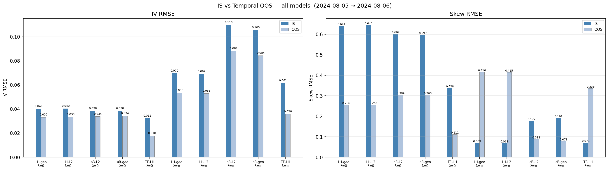
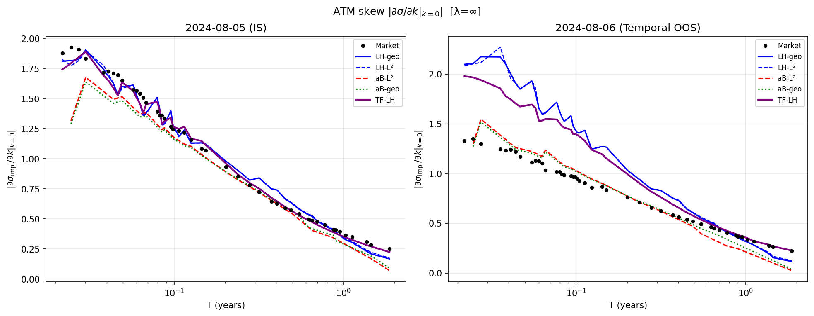

# From Rough to Lifted

**A comparative study of Markovian approximations of rough volatility models, with a proposed two-factor extension of the lifted Heston model.**

This repository contains the full code and the written document for my EPFL
bachelor thesis in mathematics. It implements, from scratch, five stochastic
volatility models, calibrates them to SPX implied volatility surfaces, and asks a
simple question: on real option data, do genuinely rough models actually beat
their tractable Markovian approximations, and can a small structural extension do
better than either?

- Author: Nolan Genaine (EPFL, Bachelor of Mathematics)
- Supervisor: Prof. Martin Hairer
- Thesis PDF: [`docs/From_Rough_to_Lifted.pdf`](docs/From_Rough_to_Lifted.pdf)
- Mathematical specification: [`docs/MODEL_SPEC.md`](docs/MODEL_SPEC.md)
- Annotated bibliography: [`PAPERS.md`](PAPERS.md)

---

## Background in one paragraph

The equity implied volatility surface has a steep at-the-money (ATM) skew that
explodes at short maturities, roughly as a power law `|psi(T)| ~ T^(H - 1/2)`
with `H` around `0.1`. Rough volatility models (Gatheral, Jaisson and Rosenbaum
2018; El Euch and Rosenbaum 2019) reproduce this by driving the variance with a
fractional kernel, but they are non-Markovian and non-semimartingale, which makes
simulation, hedging and calibration hard. The lifted Heston model (Abi Jaber
2019) recovers the rough behaviour as a limit of a finite sum of ordinary
mean-reverting factors, staying Markovian and tractable through a system of
Riccati ODEs. Recent empirical work (Cont and Das 2023; Abi Jaber and Li 2025)
questions whether roughness is really needed, or even identifiable, on real data.
This thesis puts that question to the test.

## The five models

| Model | Code name | Variance dynamics | Kernel | Pricing engine | Package |
|-------|-----------|-------------------|--------|----------------|---------|
| Lifted Heston | `LH-geo` | square-root (CIR-type) | geometric Laplace grid | Riccati + COS (closed form) | [`src/lifted_heston`](src/lifted_heston) |
| Lifted Heston | `LH-L2` | square-root (CIR-type) | L2-optimised exp-sum | Riccati + COS | [`src/lifted_heston`](src/lifted_heston) |
| aBergomi | `aB-L2` | lognormal forward-variance | L2-optimised exp-sum | Monte Carlo | [`src/abergomi`](src/abergomi) |
| aBergomi | `aB-geo` | lognormal forward-variance | geometric grid | Monte Carlo | [`src/abergomi`](src/abergomi) |
| Two-factor lifted Heston | `TF-LH` | two independent square-root blocks (rough + slow CIR) | geometric grid + CIR | Riccati + COS | [`src/two_factor_lifted_heston`](src/two_factor_lifted_heston) |

Two further models support the study: the **rough Heston** benchmark
([`src/rough_heston`](src/rough_heston)), used as the exact "rough" ground truth
in the convergence experiment, and a **symmetric two-factor** variant
([`src/two_factor_symmetric`](src/two_factor_symmetric)) developed as a
positivity-clean remedy to the original two-factor construction.

All models are fed the **same** initial forward-variance curve `xi0(t)`, extracted
from the market ATM term structure, so the comparison isolates the variance
specification rather than the input curve.

## Selected results



*IV-RMSE (left) and ATM-skew RMSE (right), in-sample versus next-day out-of-sample,
for the five models under two calibration objectives (`lambda=0`: full-surface IV
fit; `lambda=inf`: pure ATM-skew fit), on the 2024-08-05 to 2024-08-06 SPX pair.*



*The ATM-skew term structure under the pure-skew objective. In-sample (left) every
model tracks the market; out-of-sample (right) the lifted Heston variants overshoot
the short-end skew while the rigid aBergomi kernel tracks the market better.*

Honest headline findings (see the thesis for the full picture):

- **Kernel choice barely matters.** Within each family, the geometric grid and the
  L2-optimised kernel give essentially tied full-surface IV-RMSE. The differences
  between lifted Heston and aBergomi come from the variance specification
  (square-root vs lognormal), not the kernel.
- **aBergomi fits the skew level better, sometimes.** Its lognormal variance
  captures the intrinsic ATM-skew level better than lifted Heston on a typical
  date (up to a five-fold lower skew RMSE), but the advantage is regime dependent.
- **The Hurst index is not robustly identifiable under Q.** Calibrated `H` sits
  near `0.02` under an IV-RMSE objective but rises to `0.25`-`0.29` under an
  ATM-skew objective on the same surface. The thesis reads this objective
  dependence as a quantitative signal of single-kernel misspecification,
  complementary to the Cont and Das (2023) critique.
- **The two-factor extension helps on IV-RMSE, with caveats.** `TF-LH` attains the
  lowest full-surface IV-RMSE on every date tested, in and out of sample, but it
  does not beat aBergomi on skew level, and the second block calibrates to a fast
  factor rather than the slow one its theory anticipated. The gain buys four extra
  parameters and is not tested against an information criterion. Evidence rests on
  three train/test pairs, one of which is a stress day, so this is a proof of
  concept, not a temporal-stability result.

## Repository layout

```
rough-to-lifted/
├── README.md                 you are here
├── PAPERS.md                 annotated bibliography (what each reference is and how it is used)
├── LICENSE                   MIT for code; CC BY 4.0 for the thesis document
├── requirements.txt          Python dependencies
├── pytest.ini
├── docs/
│   ├── From_Rough_to_Lifted.pdf   the thesis
│   ├── MODEL_SPEC.md              equations, numerical schemes, hyperparameters
│   └── assets/                    figures used in this README
├── src/                      the models and the machinery (see "Code map" below)
├── scripts/                  reproducible experiment pipeline (see scripts/README.md)
├── tests/                    pytest suite
└── data/                     data loader docs + a synthetic sample (no market data shipped)
```

### Code map (`src/`)

| Package | What it provides |
|---------|------------------|
| [`common`](src/common) | Black-76 pricing and implied-vol inversion, the Fang-Oosterlee COS Fourier engine, and forward-variance curves. Shared by every affine model. |
| [`lifted_heston`](src/lifted_heston) | The lifted Heston model: geometric kernel grid, the n-factor Riccati solver, the affine characteristic function, and the COS implied-vol surface. |
| [`rough_heston`](src/rough_heston) | Rough Heston benchmark: a fractional Riccati (Adams predictor-corrector) solver and COS pricing, used as exact ground truth. |
| [`abergomi`](src/abergomi) | The affine Bergomi model: L2 kernel fit, an exact-OU Monte Carlo simulator with QMC and antithetics, and MC pricing with standard errors. |
| [`two_factor_lifted_heston`](src/two_factor_lifted_heston) | The proposed extension: a rough lifted block plus an independent CIR block, factorised characteristic function, COS pricing, and an Euler-Maruyama validator. |
| [`two_factor_symmetric`](src/two_factor_symmetric) | Positivity-clean symmetric split of the two-factor model (an additive convex partition of `xi0`), with an optional maturity-dependent split. |
| [`calibration`](src/calibration) | The IV-surface loss (vega-weighted IV-RMSE plus optional ATM-skew term) and the global-then-local optimizer used for every model. |
| [`data`](src/data) | SPX surface loading and cleaning, forward-variance extraction, SVI smile fitting, and a synthetic-surface generator. |

## Installation

Requires Python 3.10 or newer.

```bash
git clone https://github.com/<your-username>/rough-to-lifted.git
cd rough-to-lifted

python -m venv .venv
# Windows:  .venv\Scripts\activate
# Unix:     source .venv/bin/activate

pip install -r requirements.txt
```

## Quick start

Everything below runs with no market data. Run from the repository root.

```bash
# 1. Gating sanity checks: every line must print OK.
python scripts/00_sanity_checks.py

# 2. Reproduce the lifted-Heston -> rough-Heston convergence in n.
python scripts/01_lh_convergence.py

# 3. Calibrate models to a known synthetic surface (recovers ground-truth params).
python scripts/03_synthetic_comparison.py

# 4. Generate a synthetic option chain, then run the main comparison on it.
python scripts/make_sample_data.py
python scripts/04_spx_comparison.py --data data/sample_synthetic_spx.csv

# Run the test suite.
pytest tests/
```

To run the empirical experiments on **real** SPX surfaces you must supply your own
option data (see the licensing note below and [`data/README.md`](data/README.md)).
The full script pipeline, with each script grouped and explained, is documented in
[`scripts/README.md`](scripts/README.md).

## Data and licensing

**No proprietary market data is shipped with this repository.** The SPX and CBOE
option chains used in the thesis come from CBOE DataShop and Polygon.io, whose
licenses do not permit public redistribution. The `.gitignore` excludes
`data/*.csv` so market data is never committed by accident. What ships instead is
`data/sample_synthetic_spx.csv`, a fully synthetic chain generated by
`scripts/make_sample_data.py`, which lets every real-data script run out of the
box. See [`data/README.md`](data/README.md) for the exact CSV format and for how
to obtain real data.

## How to cite

If you use this code or the thesis, please cite:

```bibtex
@mastersthesis{genaine2026roughtolifted,
  author = {Genaine, Nolan},
  title  = {From Rough to Lifted: A Comparative Study of Markovian Approximations
            of Rough Volatility Models, with a Proposed Two-Factor Extension of
            the Lifted Heston Model},
  school = {Ecole Polytechnique Federale de Lausanne (EPFL)},
  year   = {2026},
  type   = {Bachelor thesis}
}
```

## License

Source code (`src/`, `scripts/`, `tests/`) is released under the MIT License. The
thesis document in `docs/` is shared under the Creative Commons Attribution 4.0
International license (CC BY 4.0). See [`LICENSE`](LICENSE).
